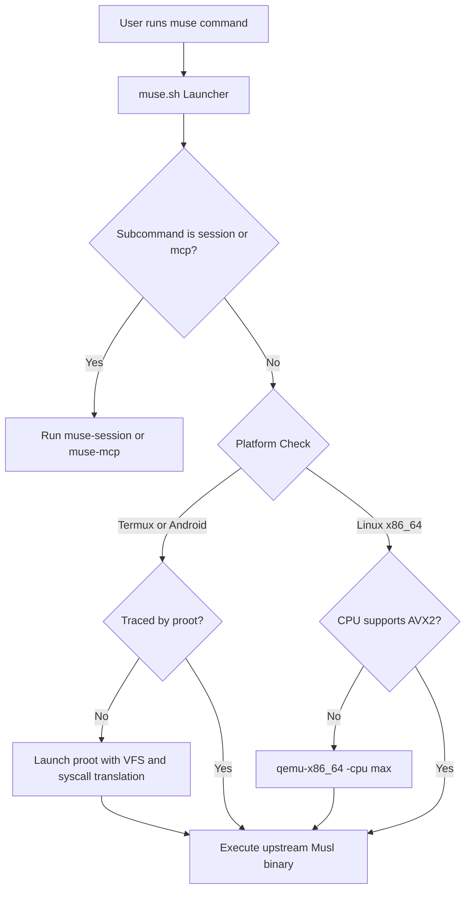

# ⚡ Muse Code

[](https://github.com/Twilight0/muse-code/actions/workflows/release.yml)
[](https://aur.archlinux.org/packages/muse-code-bin)
[](https://github.com/Twilight0/muse-code/releases)
[](LICENSE)

**Muse Code** is a high-performance terminal coding assistant and AI agent powered by Meta's Muse Spark engine ([dev.meta.ai](https://dev.meta.ai)).

This repository provides enhanced, production-ready packaging for **Arch Linux / AliveOS (Pacman / AUR)** and **Android (Termux aarch64)** with zero-configuration hardware compatibility, an interactive terminal session manager, multi-agent Model Context Protocol (MCP) synchronization, and automated CI/CD releases.

---

## 📑 Table of Contents

- [✨ Key Features & Enhancements](#-key-features--enhancements)
  - [1. Native Android / Termux Support (aarch64)](#1-native-android--termux-support-aarch64)
  - [2. AVX2 Instruction Emulation for Legacy CPUs](#2-avx2-instruction-emulation-for-legacy-cpus)
  - [3. Interactive TUI Session Manager (`muse sessions`)](#3-interactive-tui-session-manager-muse-sessions)
  - [4. Multi-Agent MCP Server Bridge (`muse mcp`)](#4-multi-agent-mcp-server-bridge-muse-mcp)
- [📥 Installation](#-installation)
  - [Arch Linux / Manjaro / EndeavourOS](#arch-linux--manjaro--endeavouros)
  - [AliveOS (Pre-built Binary Repository)](#aliveos-pre-built-binary-repository)
  - [Android (Termux ARM64)](#android-termux-arm64)
  - [Manual Build & Packaging](#manual-build--packaging)
- [🚀 Quick Start & Usage](#-quick-start--usage)
  - [Basic Invocation](#basic-invocation)
  - [Session Manager (`muse sessions`)](#session-manager-muse-sessions)
  - [MCP Server Management (`muse mcp`)](#mcp-server-management-muse-mcp)
  - [Authentication & Provider Configuration](#authentication--provider-configuration)
- [🔧 Architecture & Implementation](#-architecture--implementation)
- [❓ Troubleshooting & FAQ](#-troubleshooting--faq)
- [📄 License & Terms](#-license--terms)

---

## ✨ Key Features & Enhancements

### 1. Native Android / Termux Support (`aarch64`)
* **The Problem**: Upstream Meta binaries are statically compiled against Musl libc. On Android, standard execution fails immediately with **`unknown signal 31` (`SIGSYS`: Bad System Call)** because Android's Zygote `seccomp` sandbox blocks newer Linux syscalls (notably `openat2`, syscall 437 on aarch64). Furthermore, static binaries bypass `LD_PRELOAD` (`termux-exec`), leaving paths like `/bin/sh` and `/etc/resolv.conf` unresolvable.
* **Our Solution**:
  * An intelligent runtime wrapper automatically detects Android/Termux environments (`TERMUX_VERSION` / `/data/data/com.termux`).
  * Seamlessly launches under a customized `proot` virtualization layer that intercepts blocked system calls via `ptrace` and provides a standard Linux Virtual Filesystem (VFS) layout.
  * Preserves CLI arguments verbatim (`"$@"`), prevents recursive nested proot tracing, sets up TLS certificate stores (`SSL_CERT_FILE`), and resolves working directories cleanly.
  * Packaged as a clean Termux Debian package (`.deb`) installable directly via `dpkg -i` or `apt`.

### 2. AVX2 Instruction Emulation for Legacy CPUs
* **The Problem**: The official upstream x86_64 binary requires AVX2 instructions (introduced in Intel Haswell, 2013). Running on older hardware (such as Intel Sandy Bridge, Ivy Bridge, older Celerons, or early AMD architectures) triggers a fatal `Illegal instruction (core dumped)` crash.
* **Our Solution**:
  * The wrapper inspects `/proc/cpuinfo` on `x86_64`.
  * If `avx2` support is absent, it seamlessly delegates execution to `qemu-x86_64 -cpu max "$REAL_BIN" "$@"`, allowing Muse Code to run on legacy computers without user intervention.

### 3. Interactive TUI Session Manager (`muse sessions`)
Muse Code organizes sessions with UUIDs. We provide an integrated curses-based full-screen terminal interface to manage them:

```
┌────────────────────────────────────── Muse Code Sessions ──────────────────────────────────────┐
│  DATE & TIME       SESSION UUID                          SIZE      WORKSPACE / TITLE / PROMPT   │
│  2026-09-07 11:53  01a07b12-aaf3-78a0-a819-1cf8ec571c09  311.8 KB  ~/projects/app - "fix auth"  │
│  2026-09-07 09:20  01a07a21-4f11-7a10-b991-0e12ca001b92   84.2 KB  ~/code/agent - "refactor"    │
└────────────────────────────────────────────────────────────────────────────────────────────────┘
 [Enter] Resume  [F2/r] Rename  [F4/d] Delete  [i] Info  [w] Toggle CWD  [?] Help  [q] Quit
```

* **Features**:
  * **One-Key Resume**: Select any session and press <kbd>Enter</kbd> to resume immediately (`muse resume <UUID>`).
  * **Custom Titles**: Press <kbd>F2</kbd> or <kbd>r</kbd> to assign memorable titles to long-running tasks.
  * **Workspace Filter**: Press <kbd>w</kbd> to toggle between sessions from the current directory vs global history.
  * **Safe Deletion**: Single and bulk deletion (<kbd>F4</kbd>/<kbd>d</kbd>) with safety confirmations.
  * **CLI Mode**: Full scriptable CLI interface (`muse sessions list`, `muse sessions rename`, `muse sessions delete --older-than 14d`).

### 4. Multi-Agent MCP Server Bridge (`muse mcp`)
Connect your external Model Context Protocol (MCP) servers effortlessly:
* **One-Click Import**: Automatically scans and imports MCP configurations from:
  * **OpenCode** (`~/.config/opencode/opencode.json`)
  * **Codex CLI** (`~/.codex/config.toml`)
  * **Claude Desktop** (`~/.config/Claude/claude_desktop_config.json`)
  * **Antigravity CLI** (`~/.gemini/antigravity-cli/mcp/`)
* **Full CRUD Management**: List, add, enable, disable, and remove MCP servers stored directly in `~/.config/muse/settings.json`.

---

## 📥 Installation

### Arch Linux / Manjaro / EndeavourOS

#### From the AUR (Arch User Repository)
Install using your preferred AUR helper:
```bash
yay -S muse-code-bin
# or
paru -S muse-code-bin
```

### AliveOS (Pre-built Binary Repository)
Add the official AliveOS repository to `/etc/pacman.conf`:
```ini
[aliveos-repo]
SigLevel = Optional TrustAll
Server = https://Twilight0.github.io/aliveos-repo/$arch
```
Update databases and install:
```bash
sudo pacman -Syu muse-code
```

### Android (Termux ARM64)

1. Open Termux on your `aarch64` Android device.
2. Download the latest `.deb` package from [GitHub Releases](https://github.com/Twilight0/muse-code/releases):
   ```bash
   curl -fLO https://github.com/Twilight0/muse-code/releases/latest/download/muse-code_1.0.3.r2198.1-1_termux_aarch64.deb
   ```
3. Install the package using `apt` or `dpkg`:
   ```bash
   apt install ./muse-code_1.0.3.r2198.1-1_termux_aarch64.deb
   # Dependencies (proot, python, ca-certificates) will be installed automatically
   ```
4. Run:
   ```bash
   muse
   ```

### Manual Build & Packaging

#### Arch Linux (`makepkg`)
```bash
git clone https://github.com/Twilight0/muse-code.git
cd muse-code
makepkg -si
```

#### Termux Package (`build-termux.sh`)
Build the `.deb` archive on any Linux x86_64 or aarch64 workstation:
```bash
./build-termux.sh
# Generated deb will be in dist/
```

---

## 🚀 Quick Start & Usage

### Basic Invocation

```bash
# Start interactive TUI coding agent in the current workspace
muse

# Launch with an initial prompt
muse "Audit the codebase for potential memory leaks and race conditions"

# Headless / non-interactive execution
muse exec "Run the test suite and summarize failures"

# Attach a local screenshot or diagram
muse --image mockup.png "Implement this frontend UI layout in Tailwind CSS"

# Trust workspace and bypass safety approval prompts
muse --yolo
```

### Session Manager (`muse sessions`)

The session helper can be invoked via `muse sessions` or `muse-session`:

```bash
# Open interactive curses picker
muse sessions

# List all recorded sessions with sizes and timestamps
muse sessions list

# Filter sessions created within the current directory
muse sessions list --cwd

# Inspect session details, metadata, and runtime tokens
muse sessions info <SESSION-UUID>

# Rename a session
muse sessions rename <SESSION-UUID> "Refactor Database Schema"

# Delete sessions older than 7 days
muse sessions delete --older-than 7d
```

### MCP Server Management (`muse mcp`)

Configure and bridge MCP tools for Muse Code:

```bash
# List all active and configured MCP servers
muse mcp list

# Import all detected servers from other coding agents
muse mcp import --all

# Import specifically from Claude Desktop or OpenCode
muse mcp import --from claude
muse mcp import --from opencode

# Add a standard stdio MCP server
muse mcp add fetch --command "uvx" --args "mcp-server-fetch"

# Enable / disable a configured server
muse mcp disable fetch
muse mcp enable fetch

# Remove a server
muse mcp remove fetch
```

### Authentication & Provider Configuration

Store API credentials securely (stored in local keychain or secure config, never in shell history):

```bash
# Configure Meta provider credentials
muse auth set --provider meta --api-key-stdin < your_api_key.txt

# Or test with the offline deterministic echo provider
muse exec --provider echo "Hello Muse"
```

---

## 🔧 Architecture & Implementation



| Component | Path | Description |
| :--- | :--- | :--- |
| **Launcher** | `/usr/bin/muse` | Shell wrapper coordinating proot, AVX2 fallback, and helper delegation. |
| **Session Helper** | `/usr/lib/muse/muse-session` | Standalone Python curses TUI & metadata parser. |
| **MCP Helper** | `/usr/lib/muse/muse-mcp` | Multi-agent Model Context Protocol bridge. |
| **Real Binary** | `/usr/lib/muse/muse` | Upstream official Meta Muse Spark executable. |
| **Symlinks** | `/usr/bin/muse-code`, `muse-session`, `muse-mcp` | Ergonomic aliases for scripts and shell completions. |

---

## ❓ Troubleshooting & FAQ

### Termux: Permission Denied on `/tmp` or Storage
* Muse runs within a sandboxed virtual rootfs under proot. If you need external storage access, ensure you have run `termux-setup-storage` and access files via `/storage/emulated/0` or `/sdcard`.
* The package automatically configures `TMPDIR` to `$PREFIX/tmp` (`/data/data/com.termux/files/usr/tmp`).

### Termux: Bubblewrap Warning
* Under unrooted Termux, Linux user namespaces are unavailable, so Bubblewrap sandboxing (`bwrap`) is not functional. Muse detects this automatically and logs:
  `muse: Bubblewrap is unavailable for linux: no capability-valid system bwrap was found...`
* This is completely normal on Android and does not affect code generation or tool operations.

### Legacy x86_64 CPU: "Illegal instruction"
* If you run Muse on an older CPU and see an illegal instruction error, ensure `qemu-user` is installed:
  ```bash
  sudo pacman -S qemu-user
  ```
  The wrapper will then automatically route execution through QEMU CPU emulation.

---

## 📄 License & Terms

* The packaging scripts, helpers, and integration layers are released under the **[MIT License](LICENSE)**.
* **Muse Code** and its underlying model APIs are proprietary technology of Meta Platforms, Inc. and are subject to the [Meta Model API Terms of Service](https://dev.meta.ai).
